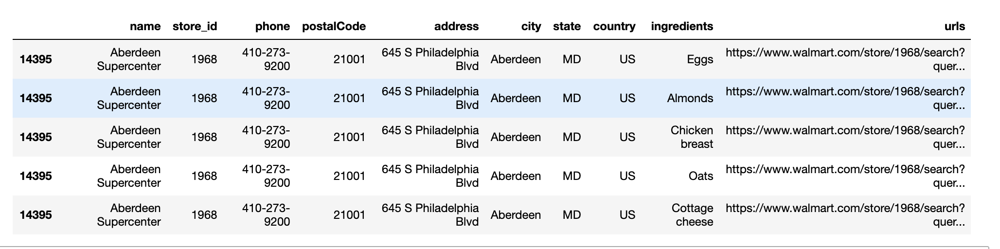
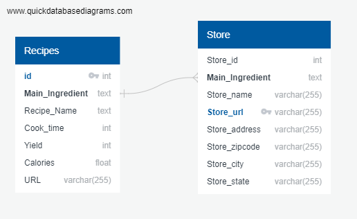
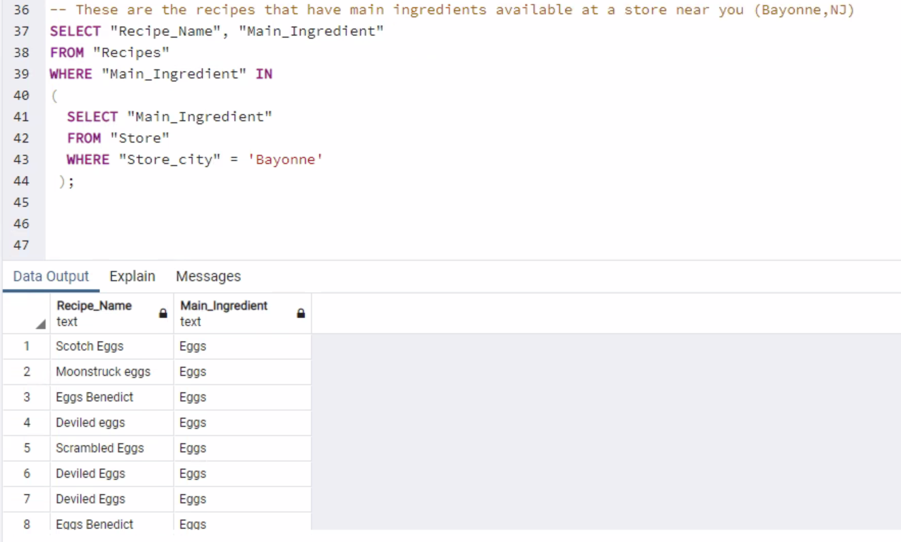
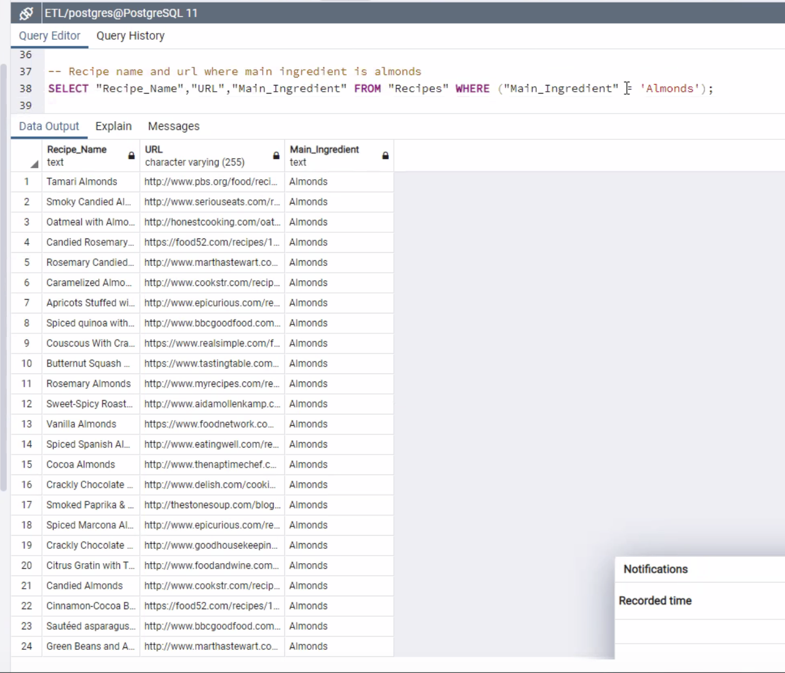
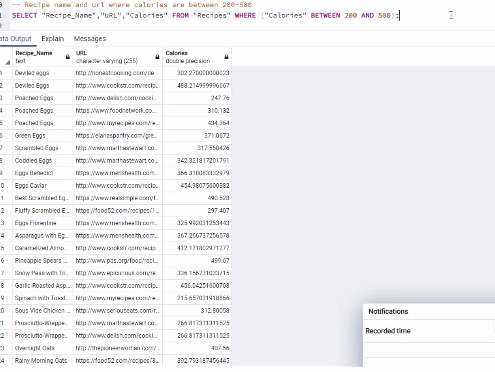
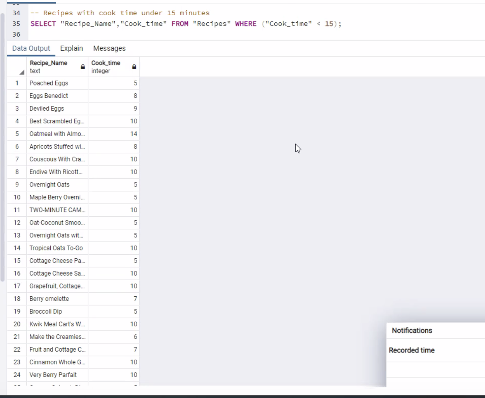
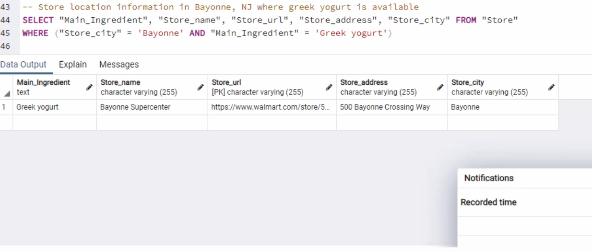

# the_kitchen_ETL

ETL Project - Bringing people together one recipe at a time

## Project Team / Organization
<table>
  <th>Name</th>
  <th>Title</th>
  <tr>
   <td>Kevin Lam</td>
    <td>Programmer Analyst</td>
  </tr>
   <tr>
    <td>Rachel Chan</td>
    <td>Programmer Analyst</td>
  </tr>
  <tr>
    <td>Ramyata Upmaka</td>
    <td>Programmer Analyst</td>
  </tr>
  <tr>
  </tr>
    <td>Ozzie Moreno</td>
    <td>Programmer Analyst</td>
</table>

## Project Overview

* A description of what each team member will be responsible for
    1. GitHub setup - Ozzie
    2. Extract Data - All (Primary contributors: Webscraping:Rachel, Edamam API: Ramyata, Kevin, Walmart API: Ozzie)
    4. Pandas / Data transforming - All
    5. Setting up database - All
    6. Read Me - All

Collapse

<!-- Wanted to get a format down. We can change it as we see fit. - Kevin -->

## Extraction

---

Edamam API | Beautiful Soup | Pandas | <!-- (Insert other tools....) -->

### **Methods**

---

Webscraped Healthline's '20 Delicious High Protein foods to Eat'. [Take a look!](https://www.healthline.com/nutrition/20-delicious-high-protein-foods#TOC_TITLE_HDR_2)

Webscraping Process:

* Created for loop to scrape the 20 high protein foods. Split into two lists due to numbering removal.

* Removed numbering from the two lists.

* Concatenated the list to form a combined list using `ingredients = newlst+newlst2`

* Removed unnecessary words.

Edamam API:

Using the edamam api, pulled the top 50 recipe lists for each protein.

API Process:

* We used the ingredient list to query 50 recipes for each list element. We used a for loop to pull the recipes and saved them in lists.

  * For each recipe, we returned the label, yield, url, cook time, and calorie information.
  
* Then, we saved the recipe data into a pandas dataframe.

#### **The Recipes**

Looking for the following:

* Recipe Name

* Cooking Time

* Serving Yield

* Calories

* Main Ingredients

* Recipe Url

<!-- Any other things we may want -->

### **Store Locator**

To find the stores, we have two separate steps. The first is finding the stores within New Jersey, and the second is to find whether the stores have the items we need.

Through an api we searched for Walmart stores within New Jersey.

1. We first uploaded a csv that contains all of the zipcodes within the United States.

2. With all of the zipcodes uploaded, we only look for the zipcodes that are in New Jersey.

3. We then found the stores within a 1 mile radius of each zipcode.

4. We pushed this information into a dataframe which will be cleaned.

To find whether the store has the main ingredient, we will Walmart's query feature to find if the item is available.

1. Using the clean dataframe, we use the store id and the main ingredients to create the url. This search will show the Walmart website and let the user know if the store has the item.

2. With the url complete a new dataframe is created to have Store Name, Store ID, Store Address, Store Zipcode(Zip), Main Ingredient, and Store URL.

## Transform

---

Pandas | <!-- (Other tools if needed) -->

### **Methods**

Cleaning our data:

**Recipes Dataframe:**

* Removed words "recipes" or "recipe" from entire dataframe:

  * Sample code:
  
  `food_df["Recipe Name"].replace({' recipes':''},regex=True)`
  
* Split the recipe dataframe by main ingredient using the `loc` property to catch spelling/formatting errors more easily:

  * Sample code:
  
  `greek_yo_df=food_df.loc[food_df["Main Ingredient"]=="Greek yogurt"]`
  
* Corrected spelling:

  * Sample code:
  
  `food_df["Recipe Name"].replace("Quinoa Tabouleh", "Quinoa Tabbouleh", inplace=True)`
  
  * Sample code: `food_df["Recipe Name"]=food_df["Recipe Name"].replace({'chilli':'chili'},regex=True)`
  
* Removed unnecessary words:

  * Sample code:
  
  `food_df["Recipe Name"].replace("Diane's Sugared Peanuts", "Sugared Peanuts", inplace=True)`

**Store Locator:**

Store Locator and Main Ingredient Data Process:

* Reformatted the address column in the original dataframe by extracting the location information from a dictionary.

* Narrowed the dataframe down by state (NJ), although we included stores within a one mile radius. So, some in other states were included.

* Removed any duplicated "store ids".

* Determined the length of the dataframe with unique store ids.

* Created a new column based off of the ingredient list and added the column to the store id dataframe.

  * To do this, we looped through each ingredient for every unique store id entry.
  
* Created a new column based off of both the store id and ingredient list in order to populate the column with a unique url list. Added this column to the store id dataframe.

* Exported this store locator dataframe to a csv.

* 

## Load

---

### **Methods**

* Created an erd for the tables.

* Created the tables within postgresql.

* Updated the dataframes to ensure that they can be properly uploaded to the sql server.

## Query time

---
Below are some sample queries that we ran through our database:

<!-- Honestly some things that I quickly thought of. We can do other things. - Kevin -->

### **Location Query**

Query for recipes that have main ingredients in stock at a store near you. Location: Bayonne, NJ.

### **Main Ingredient Query**

Query finding recipe name and url where teh main ingredient is almonds.

### **Calories Query**

Query finding recipe name and url for a range of calories: 200-500.

### **Cook Time Query**

Query finding recipes for cook times under 15 minutes.

### **Location and Main Ingredient Query**

Query finding recipes for store location (Bayonne, NJ) and main ingredient (greek yogurt).

