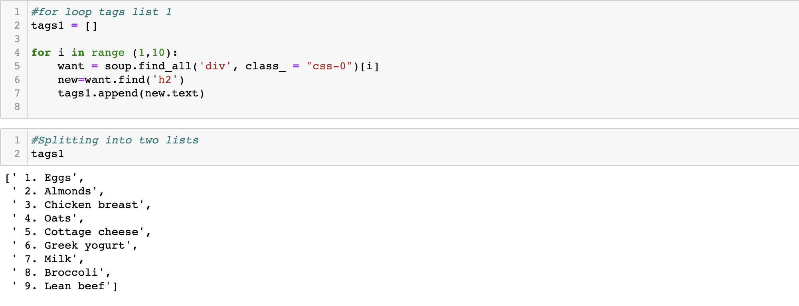
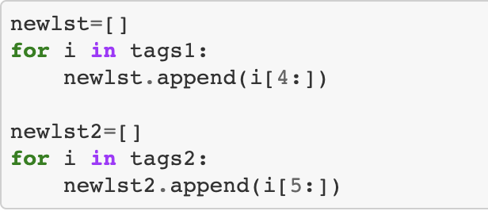
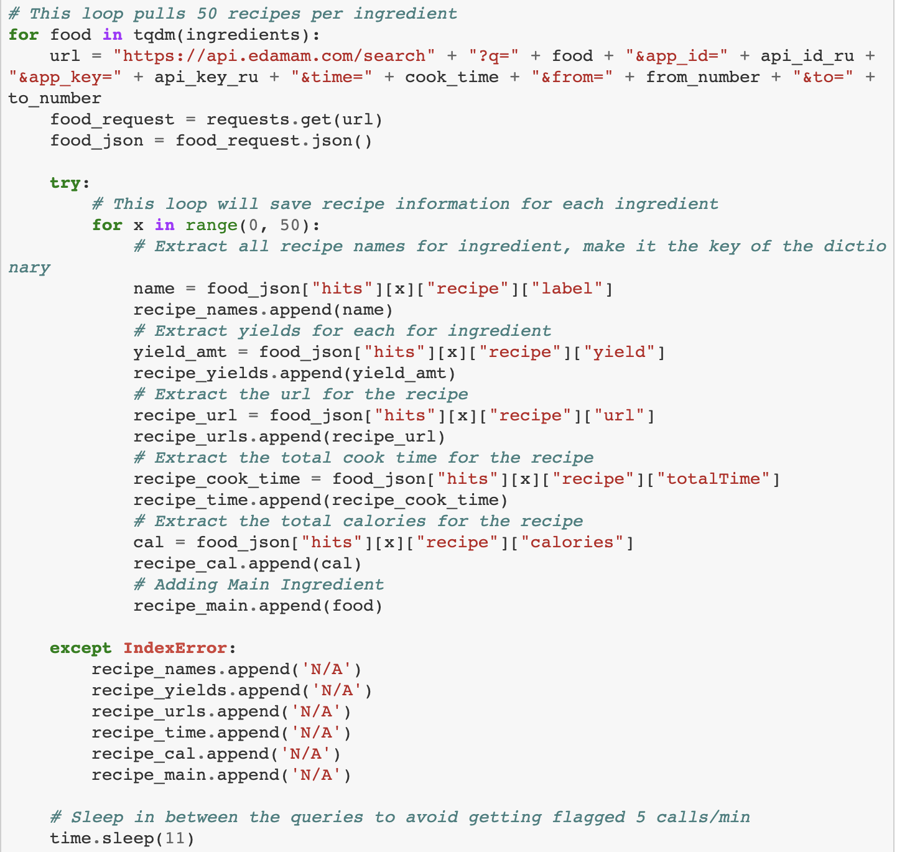
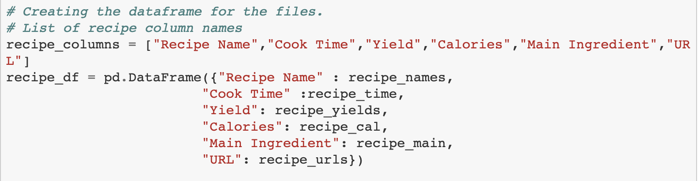

# the_kitchen_ETL

ETL Project - Bringing people together one recipe at a time

## Project Team / Organization
<table>
  <th>Name</th>
  <th>Title</th>
  <tr>
   <td>Kevin Lam</td>
    <td>Programmer Analyst</td>
  </tr>
   <tr>
    <td>Rachel Chan</td>
    <td>Programmer Analyst</td>
  </tr>
  <tr>
    <td>Ramyata Upmaka</td>
    <td>Programmer Analyst</td>
  </tr>
  <tr>
  </tr>
    <td>Ozzie Moreno</td>
    <td>Programmer Analyst</td>
</table>

## Project Overview

PURPOSE/SCOPE:  

* A brief description of your final database
    Our database will house 900+ recipes made with atleast one of the top 20 high protein ingredients listed by Healthline.com. You can find the name, yield, cooktime, main high-protein ingredient used in the recipe and the url to the recipe in the database. You can also find a coupon to the main ingredient at your local Walmart using the database.
* Why your final database will be useful to a hypothetical organization
    Everyone likes to try out interesting recipes that are also a good source of protein, and save money!
* A list your data sources
    Edamam Recipes API
    Top 20 high protein foods from a healthline.com article
    Walmart API
* A brief summary of the three ETL steps you will take to create this database
    1. Webscrape the list of top 20 high protein foods from the healthline.com article
    2. Extract recipe data from the Edamam Recipe API that utilize atleast one of the top 20 high protein foods as the main ingredient
    3. Extract relevant store and coupon data from Walmart's API for the main ingredients
    4. Use Pandas to create dataframes with only the necessary data elements, and transform the dataset by cleaning and/or removing extraneous information
    3. Map out the tables using an ERD and load the data into SQL Postgres database by using SQLAlchemy
* A description of what each team member will be responsible for
    1. GitHub setup - Ozzie
    2. Extract Data - All (Primary contributors: Webscraping:Rachel, Edamam API: Ramyata, Kevin, Walmart API: Ozzie)
    4. Pandas / Data transforming - All
    5. Setting up database - All
    6. Read Me - All

Collapse

<!-- Wanted to get a format down. We can change it as we see fit. - Kevin -->

## Extraction

---

Edamam API | Beautiful Soup | Pandas | <!-- (Insert other tools....) -->

### **Methods**

---

Webscraped Healthlines '20 Delicious High Protein foods to Eat'. [Take a look!](https://www.healthline.com/nutrition/20-delicious-high-protein-foods#TOC_TITLE_HDR_2)

Webscraping Process:
* Created for loop to scrape the 20 high protein foods. Split into two lists due to numbering removal.
  * Sample Code:

* Removed numbering from the two lists:
  * Sample Code:

* Concatenated the list to form a combined list using `ingredients = newlst+newlst2`
* Removed unnecesary words ("all types") `ingredients=[y.replace(' (all types)', '') for y in ingredients]`

Edamam API:

Using the edamam api, pulled the top 50 recipe lists for each protein.

API Process:

* Used the ingredient list to query 50 recipe lists for each list element. Used a for loop to pull the recipes and saved them in lists.
  * Sample Code:

* Placed the recipe data into a pandas dataframe:
  * Sample Code:

#### **The Recipes**

Looking for the following:

* Recipe Name
* Cooking Time
* Serving Yield.
* Calories
* Main Ingredients
* Recipe Url
<!-- Any other things we may want -->

### **Store Locator**

To find the stores, we have two seperate steps. The first is finding the stores within New Jersey, and the second is to find whether the stores have the items we need.

Through an api we searched for walmart stores within New Jersey.

1. We first uploaded a csv that contains all of the zipcodes within the United States.

2. With all of the zipcodes uploaded, we only look for the zipcodes that are in New Jersey.

3. We then found the stores within a 1 mile radius of each zipcode.

4. We pushed this information into a dataframe which will be cleaned.

To find whether the store has the main ingredient, we will Walmart's query feature to find if the item is available.

1. Using the clean dataframe, we use the store id and the main ingredients to create the url. This search will show the Walmart website and let the user know if the store has the item.

2. With the url complete a new dataframe is created to have Store Name, Store ID, Store Address, Store Zipcode(Zip), Main Ingredient, and Store URL.

## Transform

---

Pandas | <!-- (Other tools if needed) -->

### **Methods**

Cleaning our data:

**Recipes Dataframe:**

* Removed words "recipes" or "recipe" from entire dataframe:
  * Sample code:
  `food_df["Recipe Name"].replace({' recipes':''},regex=True)`
* Split the recipe dataframe by main ingredient using the `loc` property to catch spelling/formatting errors more easily:
  * Sample code:
  `greek_yo_df=food_df.loc[food_df["Main Ingredient"]=="Greek yogurt"]`
* Corrected spelling:
  * Sample code:
  `food_df["Recipe Name"].replace("Quinoa Tabouleh", "Quinoa Tabbouleh", inplace=True)`
  * Sample code: `food_df["Recipe Name"]=food_df["Recipe Name"].replace({'chilli':'chili'},regex=True)`
* Removed unnecessary words:
  * Sample code:
  `food_df["Recipe Name"].replace("Diane's Sugared Peanuts", "Sugared Peanuts", inplace=True)`

**Store Locator:**

* Reformat the address column in the original dataframe.

* Remove any duplicate "store ids"

## Load

---

### **Methods**

* Create the tables within postgresql

* Update the dataframes to ensure that they can be properly uploaded to the sql server.

* Update the 
## Query time

---

<!-- Honestly some things that I quickly thought of. We can do other things. - Kevin -->

### **Do you wanna build a deviled egg**

Recipe name, url, main ingredient.

### **Quick Snack**

Query under 15 minutes

### **Counting Calories**

Finding meals within a specific calorie range.

### **What are buying? What are ya selling?**

Find the stores that have your items in your area(New Jersey.)
